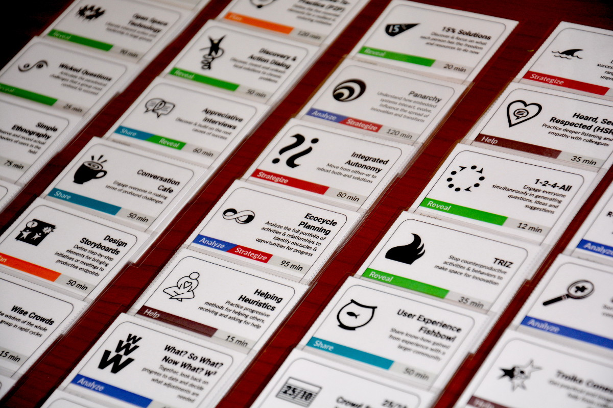

# Liberating Structures Card Deck format original amélioré et francophone. 

_Prêt à être traduit dans d'autres langues._

Une version imprimable du jeux de cartes pour les Liberating Structures.

Inspiré du jeu de cartes d'Holisticon, il peut vous aider à créer facilement des chaînes ou vous servir d'aide-mémoire pour chaque format.

Dépot originel [https://github.com/vpapadopou/liberating-structures-cards](https://github.com/vpapadopou/liberating-structures-cards)

Ajout de la version francophone et de script pour faciliter l'ajout de nouvelles langues et la préparation des pages de cartes.

## Version francophone

Version actuelle : 2.1

### Instructions

Seul le format A4 existe dans la version francophone.

[A4 Paper Size](print/fr/print-a4.pdf)

- Imprimer en recto seulement à l'aide d'une imprimante couleur
- Les cartes sont prévus pour être plié pour créé le recto-verso
- Utilisez une paire de ciseaux ou une découpeuse pour séparer soigneusement la ligne en pointillés entre deux cartes différentes.
- Pas besoin de colle, sauf si vous avez raté l'instruction précédente dans ce cas : collez le recto et le verso de la carte avec une petite quantité de colle.
- Plastifier
- Arrondir les angles pour rendre la manipulation plus agréable.

Utilisez du papier de 160 g/m2 pour une meilleure expérience. Si vous ne pouvez pas, du papier normal de 80 g/m² devrait faire l'affaire.

Normalement, vous devriez **désactiver** toute option "Ajuster à la page" et sélectionner "Taille réelle" lors de l'impression pour imprimer les cartes dans la taille prévue. Si toutefois cela ne fonctionne pas pour vous (peut-être qu'une partie de la carte est coupée), vous devriez pouvoir sélectionner "Ajuster à la page" et imprimer les cartes sans problème. Elles seront un peu plus petites, mais cela ne devrait pas affecter l'expérience globale.

## English version

Current version: 2.1

### Instructions

Please select the appropriate PDF file according to the paper size your printer uses:

[A4 Paper Size](print/en/print-a4.pdf)

[US Letter Paper Size](print/en/print-us-letter.pdf)

- Single-sided printing using a color printer.
- The cards are designed to be folded to create double-sided printing.
- Use a pair of scissors or a cutter to carefully separate the dotted line between two different cards.
- No need for glue, unless you missed the previous instruction in which case: glue the front and back sides of the card using a small amount of glue.
- Laminate.
- Round off corners to make handling more pleasant.

Use 160gsm paper for best experience. If you can't normal 80gsm paper should work just fine

Normally you should **turn off** any "Fit to Page" option and select "Actual Size" when printing to print the cards in the intended size. If however that does not work for you (maybe part of the card is trimmed), you should be able to select "Fit to Page" and print the cards without problems. They will be a bit smaller, but that should not affect the overall experience.

## Attribution

Liberating Structures are developed by Henri Lipmanowicz and Keith McCandless

Link: [http://liberatingstructures.com](http://www.liberatingstructures.com/)

The original LS Cards were created by Holisticon AG

Link: [https://holisticon.de](https://holisticon.de)

Original card deck: [amazon.de](https://www.amazon.de/Holisticon-Liberating-Structures-Design-Cards/dp/B077L6SPKR)

Liberating Structures SVG icons were created by Julian Fastnacht

Link: [https://github.com/jfastnacht](https://github.com/jfastnacht)

**Note**

Liberating Structures categories were developed by Keith McCandless & Henri Lipmanowicz and enhanced by Holisticon

## License

The Liberating Structures, the LS Cards, the LS SVG icons and this card deck are licensed under a Creative Commons License. For more information see the [license file](LICENSE.md)

